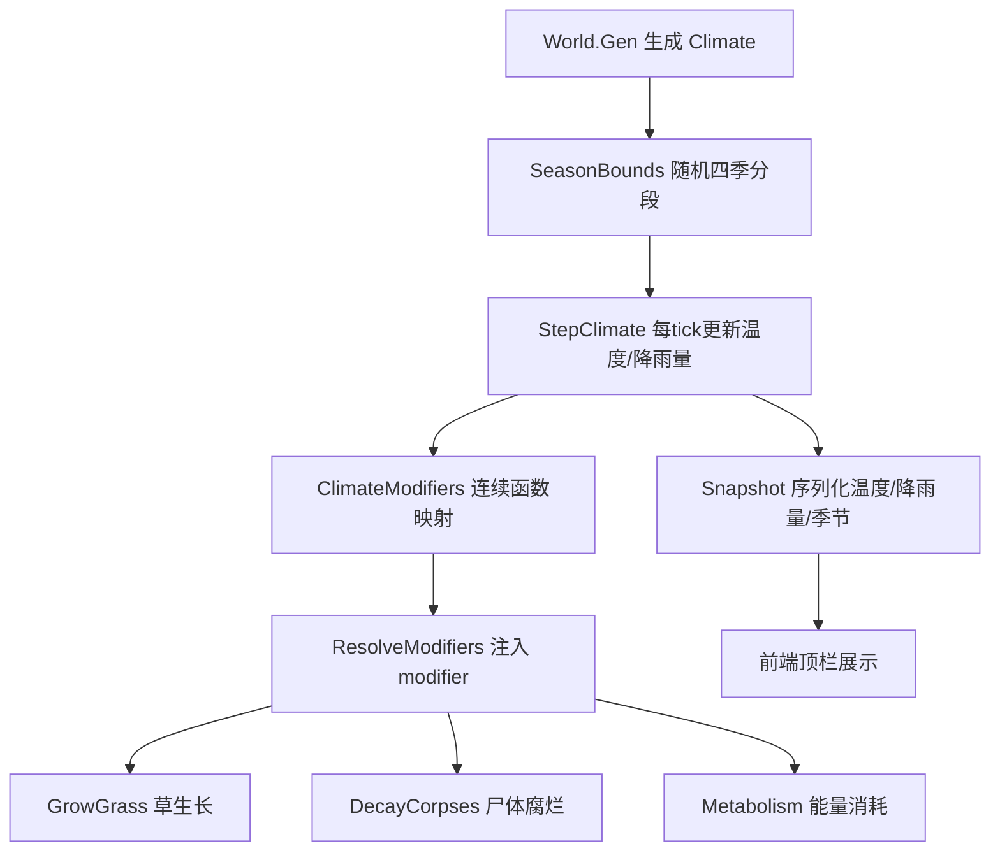

## 产品概述
为生态模拟世界新增「温度」和「降雨量」两个连续气候系统，完全取代现有的 sunny/rain/drought/storm 天气状态机。系统在每次生成世界时随机确定全年（四季）总 tick 数（300~600），并将总 tick 有扰动地划分为春夏秋冬四段不等长季节。每个季节由温度和降雨量两个连续变化的值表征，这两个值通过连续函数映射到生态参数，影响草生长速度、尸体腐烂速度、动物每 tick 能量消耗。

## 核心功能
- **随机四季总时长**：每次生成世界，用固定随机流随机全年总 tick（300~600），再扰动切分为春夏秋冬四段（各段 >0，总和 = 总 tick）。
- **温度与降雨量连续变化**：每个季节有基准温度/降雨量（夏热冬冷、春秋多雨），季节内部随时间连续渐变（线性插值或高斯曲线），并叠加小幅随机扰动。
- **连续函数映射生态系数**：
  - 草生长：温度适宜区间（高斯峰值）× 降雨正相关 → `grass.growth_mult`
  - 尸体腐烂：温度越高腐烂越快 → 新增 `corpse.decay_mult`
  - 动物代谢：温度偏离舒适区（过冷/过热）能耗上升 → 各物种 `*.metabolism` 修饰
- **废弃旧天气系统**：移除 sunny/rain/drought/storm 状态机、天气推进系统、weather_force 命令及 weather.json 中相关配置。
- **前端展示**：顶栏显示当前季节、温度、降雨量，取代旧的天气文字显示。

## 视觉/交互效果
前端顶栏新增温度（℃）与降雨量（mm）两个数字显示，季节名称随四季边界动态切换。温度/降雨量数字随 tick 平滑变化，直观反映气候连续演变，替代原有的离散天气状态文字。


## 技术栈
- 后端：Go（沿用现有 architecture：`internal/env` + `internal/systems` + `internal/config` + `internal/world` + `internal/observe`）
- 前端：原生 JS + Canvas + CSS（沿用现有 client 结构）
- 配置：JSON（balance.json / weather.json）
- 随机：`internal/rng`（固定 Stream 保证确定性）
- 参数修饰：`internal/modifier`（Mult/Add 表）

## 实现方案

### 架构策略
在现有「系统管线 + modifier 参数表」架构上做最小侵入式改造：用新的 `Climate` 结构替换 `env.WeatherState`，气候参数（温度/降雨量）在 `ResolveModifiers` 阶段换算成 modifier 注入 `c.Params`，下游 `GrowGrass`/`DecayCorpses`/`Metabolism` 仍通过查表取值，改动面收敛在 env + config + observe + 三个消费系统。

### 关键设计决策

1. **Climate 数据结构**（`internal/env/env.go` 内重定义）
   - `Climate{ SeasonBounds [4]int; Temperature float64; Rainfall float64 }`
   - `SeasonBounds` 记录四个季节各自的 tick 数（累加即可定位当前季节）
   - `Temperature`/`Rainfall` 为当前 tick 的连续值，每 tick 由 `StepClimate` 更新
   - 提供 `SeasonOf(tick, bounds)` 替代旧 `SeasonOf(tick, perSeason)`

2. **随机四季分段**（确定性）
   - 在 `World.Gen` 里用 `rng.StreamWeather`（新 stream 或复用）随机总 tick ∈ [300,600]
   - 将总 tick 分为 4 段：用随机权重扰动（例如每段基准 1/4 + 扰动 ±一定比例），归一化后保证总和 = 总 tick，每段下限 ≥ 20
   - 分段结果存入 `Climate.SeasonBounds`

3. **温度/降雨量曲线**
   - 每个季节预设基准温度（春 15、夏 28、秋 16、冬 2）与基准降雨量（夏/秋多雨、冬少雪）
   - 季节内用「线性插值」在相邻季节基准值之间平滑过渡，叠加高斯/小幅度随机扰动
   - `StepClimate` 每 tick 更新 `Temperature`/`Rainfall`，保证连续无跳变

4. **连续函数映射**（新增 `env.ClimateModifiers`）
   - 草生长：`growthMult = gauss(temp, T_opt, σ) * rainFactor(rain)`，雨越多草越快（设上限）
   - 尸体腐烂：`decayMult = 1 + tempSensitivity * (temp - T_ref)`，高温加速腐烂
   - 代谢：`metabolismMult = 1 + k * |temp - T_comfort|`，偏离舒适温度越多耗能越高
   - 上述系数作为 `modifier.Modifier{Key, Mult}` 注入，Key 分别为 `grass.growth_mult`、`corpse.decay_mult`、`<species>.metabolism`

5. **尸体腐烂接入 modifier**：`DecayCorpses` 的 `release` 计算改为 `release = (corpse.Total / corpse.TotalTicks) * c.Params.Get("corpse.decay_mult")`，并夹紧到 `Remaining`

6. **旧天气系统废弃**：删除 `env.AdvanceWeather`/`InitialWeather`/`WeatherState`/`ValidateState`/`WeatherModifiers`；删除 `systems/weather.go`（StepWeather）；`apply_commands.go` 的 `weather_force` 分支与 `core.Command.WeatherForce`、`god` 相关 payload 移除或改为 no-op；`weather.json` 删除 states/duration/transitions 部分，仅保留可复用的季节基准/映射参数

### 性能与可靠性
- 气候更新每 tick 一次，O(1) 计算，无额外遍历
- modifier 复用现有 `Resolve`，无新增复杂度
- 账本守恒不受影响（草生长仍记 `solar.grass`，代谢仍记负值，仅数值大小变化）
- 确定性由固定 `rng.Stream` 保证，golden hash 需重刷

## 实现要点（执行细节）
- **grounded**：复用 `env.SeasonOf` 的调用点（calendar.go、resolve_modifiers.go、weather.go），改为新 `SeasonOf(tick, bounds)`；复用 `modifier.Resolve` 注入气候系数；`DecayCorpses` 复用 `c.Params.Get` 模式
- **blast radius 控制**：保留 `Season` 枚举与 `String()` 方法（前端/事件依赖季节名），仅替换季节判定逻辑；`weather_force` 命令若移除需同步 `apply_commands.go`、`core.go`、`god.go`、`serve` API（若有暴露）避免编译错误
- **配置**：`balance.json` 删除 `time.ticks_per_season`（或保留但不使用），新增气候配置（季节基准温度/降雨量、映射参数）；`rules_version` 递增
- **前端**：`Snapshot` 新增 `temperature`/`rainfall`/`season` 字段；`app.js` 删除硬编码 `seasonName`，改读快照；`index.html` 顶栏替换 `#weather` 为温度/降雨量显示

## 架构设计



## 目录结构

```
SimulationWorld/
├── internal/
│   ├── env/
│   │   └── env.go                    # [MODIFY] 重写：删除 WeatherState/天气状态机，新增 Climate{SeasonBounds,Temperature,Rainfall}、SeasonOf(tick,bounds)、StepClimate、ClimateModifiers、季节基准/映射函数
│   ├── config/
│   │   └── config.go                 # [MODIFY] Balance.Time 调整；Weather 结构改造为气候配置（季节基准温度/降雨量、映射参数）；BaseSlots 新增 corpse.decay_mult 等；Validate 校验气候配置
│   ├── world/
│   │   └── world.go                  # [MODIFY] World.Weather → World.Climate；Gen 里生成随机四季分段
│   ├── systems/
│   │   ├── systems.go                # [MODIFY] pipeline 移除 StepWeather，新增 StepClimate（或并入 calendar）
│   │   ├── calendar.go               # [MODIFY] 用新 SeasonOf(tick, SeasonBounds) 判断季节变化
│   │   ├── weather.go                # [MODIFY/DELETE] 替换为 StepClimate 更新温度/降雨量
│   │   ├── resolve_modifiers.go      # [MODIFY] 用 ClimateModifiers 替代 WeatherModifiers+SeasonModifiers
│   │   ├── grow_grass.go             # [MODIFY] 已用 grass.growth_mult，无需改（modifier 注入生效）
│   │   ├── decay_corpses.go          # [MODIFY] release 乘 corpse.decay_mult
│   │   ├── metabolism.go             # [MODIFY] 已用 *.metabolism，无需改（modifier 注入生效）
│   │   └── apply_commands.go         # [MODIFY] 移除/停用 weather_force 分支
│   ├── core/
│   │   └── core.go                   # [MODIFY] 移除 WeatherForce/WeatherPayload（或保留类型但停用）
│   ├── god/
│   │   └── god.go                    # [MODIFY] 移除 WeatherPayload 别名
│   └── observe/
│       └── observe.go                # [MODIFY] Snapshot 增 temperature/rainfall/season；StateHash 写新气候字段；Sample 可选增 temperature/rainfall
├── cfg/
│   ├── balance.json                  # [MODIFY] 删 ticks_per_season（或忽略），新增气候配置，rules_version 递增
│   └── weather.json                  # [MODIFY] 删除 states/duration/transitions，改为季节基准温度/降雨量 + 映射参数
└── client/
    ├── app.js                        # [MODIFY] seasonName 改读快照；renderStats 显示温度/降雨量
    └── index.html                    # [MODIFY] 顶栏替换 weather 为温度/降雨量显示元素
```

## 关键代码结构

```go
// internal/env/env.go
type Climate struct {
    SeasonBounds [4]int // 春夏秋冬各段 tick 数
    Temperature  float64 // 当前温度（℃）
    Rainfall     float64 // 当前降雨量（mm/tick）
}

func GenSeasonBounds(r *rng.Rng, totalTicks int) [4]int  // 随机扰动分段
func SeasonOf(tick int, bounds [4]int) Season             // 定位当前季节
func StepClimate(climate *Climate, tick int, cfg *config.Root, r *rng.Rng) // 每tick更新温度/降雨量
func ClimateModifiers(cfg *config.Root, climate *Climate) []modifier.Modifier // 连续函数映射为 modifier
```

```go
// internal/config/config.go
type Climate struct {
    TotalTicksMin int      `json:"total_ticks_min"` // 300
    TotalTicksMax int      `json:"total_ticks_max"` // 600
    SeasonBase    map[string]struct {
        Temperature float64 `json:"temperature"`
        Rainfall    float64 `json:"rainfall"`
    } `json:"season_base"`
    // 映射参数：草生长高斯、腐烂温度敏感、代谢舒适区等
}
```


## 子代理
- **code-explorer**
  - 用途：在实施前进一步定位 `weather_force` 命令、`env.SeasonOf` 所有调用点、`Snapshot`/`StateHash`/前端 `seasonName` 的完整依赖链，确保废弃旧天气系统时不遗漏任何编译/运行依赖。
  - 预期结果：产出旧天气系统（WeatherState/AdvanceWeather/SeasonModifiers/WeatherModifiers/weather_force）所有引用点的完整清单，以及新气候字段需同步的序列化/前端落点，作为实施时逐项替换的依据。
