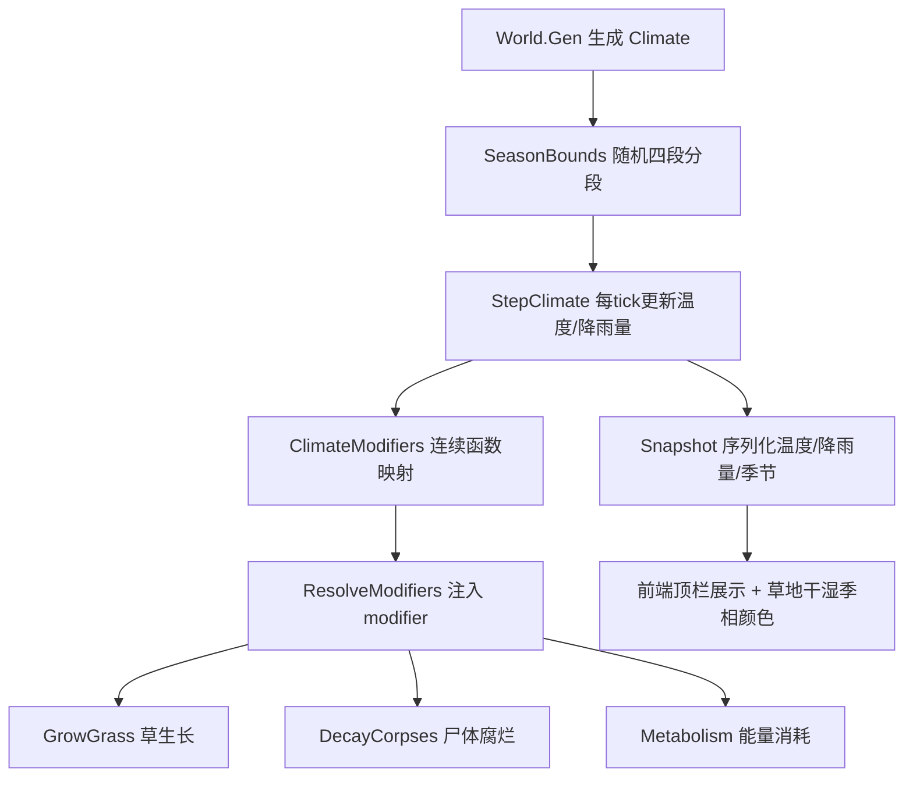

## 产品概述
新增「温度」和「降雨量」两个连续气候系统，完全替换现有的 sunny/rain/drought/storm 天气状态机。系统遵循热带草原气候（萨瓦纳气候）特征：全年温暖（年较差小、最冷月>16℃）、干湿分明、无冬季。每次生成世界时随机确定全年总 tick（300~600），扰动分为四段过渡季节（湿季初期→湿季盛期→旱季初期→旱季末期）。温度与降雨量作为连续值，通过连续函数映射到草生长速度、尸体腐烂速度、动物每 tick 能量消耗，并驱动前端草地干湿季相颜色变化。

## 核心功能
- **随机四段总时长**：用固定随机流随机全年总 tick（300~600），扰动切分为湿季初期/湿季盛期/旱季初期/旱季末期四段（各段>0，总和=总 tick）。
- **温度连续变化**：以现实热带草原最值为准（年均温 25~28℃、最冷月>18℃、最热月 30~34℃、年较差 5~10℃），四段季节有基准温度，季节内部线性插值平滑过渡并叠加小幅扰动，全年 18~34℃ 温和波动。
- **降雨连续变化**：年总 750~1000mm，湿季集中大量降雨、旱季少量零星降雨（不绝对为零），四段季节有基准降雨量，季节内部平滑过渡。
- **连续函数映射生态系数**：
  - 草生长：温度适宜区间（高斯峰值）× 降雨正相关 → `grass.growth_mult`
  - 尸体腐烂：温度越高腐烂越快 → 新增 `corpse.decay_mult`
  - 动物代谢：温度偏离舒适区能耗上升 → `*.metabolism`
- **废弃旧天气系统**：移除 sunny/rain/drought/storm 状态机、天气推进系统、weather_force 命令及相关配置。
- **前端展示**：顶栏显示当前季节、温度（℃）、降雨量（mm），草地颜色随湿度（色相绿↔黄）与草量（深浅）双重连续渐变——湿季葱绿、旱季枯黄。


## 技术栈
- 后端：Go，沿用现有 `internal/env` + `internal/systems` + `internal/config` + `internal/world` + `internal/observe` 分层架构
- 前端：原生 JS + Canvas + CSS（沿用 client 结构）
- 配置：JSON（balance.json / weather.json）
- 随机：`internal/rng`（固定 Stream 保证确定性）
- 参数修饰：`internal/modifier`（Mult/Add 表，`modifier.Resolve`）

## 实现方案

### 架构策略
在现有「系统管线 + modifier 参数表」架构上做最小侵入式改造：用新的 `Climate` 结构替换 `env.WeatherState`，气候参数（温度/降雨量）在 `ResolveModifiers` 阶段换算成 modifier 注入 `c.Params`，下游 `GrowGrass`/`DecayCorpses`/`Metabolism` 仍通过查表取值。改动面收敛在 env + config + observe + world + 三个消费系统 + 前端。

### 关键设计决策

**1. Climate 数据结构**（`internal/env/env.go`）
- `Climate{ SeasonBounds [4]int; Temperature float64; Rainfall float64 }`
- `SeasonBounds` 记录四段季节各自的 tick 数（累加定位当前季节）
- 新增季节枚举常量：`SeasonWetEarly/SeasonWetPeak/SeasonDryEarly/SeasonDryLate`（替代 Spring/Summer/Autumn/Winter，但保留 `Season` 类型和 `String()` 以兼容事件）
- `SeasonOf(tick int, bounds [4]int) Season` 替代旧的 `SeasonOf(tick, perSeason)`

**2. 随机四段分段**（`World.Gen` 内，确定性）
- 用 `rng.New(w.Seed, rng.StreamWorldGen, 0, 0)` 随机总 tick ∈ [300,600]
- 随机权重扰动分为 4 段，归一化保证总和=总 tick，每段下限≥20（避免极端短季节）
- 分段结果存入 `Climate.SeasonBounds`

**3. 温度/降雨曲线**
- 四段季节基准（温度℃ / 降雨 mm/tick）：
  - wet_early（湿季初期）：27℃ / 中偏高
  - wet_peak（湿季盛期）：26℃ / 最高
  - dry_early（旱季初期）：30℃ / 骤降但仍有少量
  - dry_late（旱季末期）：33℃ / 最低（零星小雨，非零）
- 季节内线性插值在相邻季节基准值间平滑过渡，叠加小幅随机扰动，保证连续无跳变
- `StepClimate` 每 tick 更新 `Temperature`/`Rainfall`

**4. 连续函数映射**（新增 `env.ClimateModifiers`）
- 草生长：`growthMult = gauss(temp, T_opt≈27, σ) * rainFactor(rain)`，雨越多草越快（设上限），Key=`grass.growth_mult`
- 尸体腐烂：`decayMult = 1 + k*(temp - T_ref)`，高温加速，Key=`corpse.decay_mult`
- 代谢：`metabolismMult = 1 + k*|temp - T_comfort|`，偏离舒适区耗能↑，Key=`<species>.metabolism`
- 系数作为 `modifier.Modifier{Key, Mult}` 注入

**5. 尸体腐烂接入 modifier**：`DecayCorpses` 的 `release = (corpse.Total/corpse.TotalTicks) * c.Params.Get("corpse.decay_mult")`，夹紧到 `Remaining`

**6. 旧天气系统废弃**：删除 `env.AdvanceWeather/InitialWeather/WeatherState/ValidateState/WeatherModifiers/SeasonModifiers`；`systems/weather.go` 替换为 `StepClimate`；`apply_commands.go` 移除 `weather_force` 分支；`core.go`/`god.go` 移除 `WeatherPayload`/`WeatherForce`；`weather.json` 删除 states/duration/transitions，改为季节基准温度/降雨量 + 映射参数

### 性能与可靠性
- 气候更新每 tick O(1)，无额外遍历；modifier 复用现有 `Resolve`，无新增复杂度
- 账本守恒不受影响（草生长仍记 `solar.grass`、代谢仍记负值，仅数值大小变化）
- 确定性由固定 `rng.Stream` 保证，golden hash 需重刷

## 实现要点（执行细节）
- **grounded**：复用 `env.SeasonOf` 调用点（calendar.go、resolve_modifiers.go、weather.go）改为新签名；复用 `modifier.Resolve` 注入气候系数；`DecayCorpses` 复用 `c.Params.Get` 模式
- **blast radius**：保留 `Season` 类型与 `String()`（事件/前端依赖季节名），仅替换枚举值和判定逻辑；`weather_force` 移除需同步 apply_commands.go、core.go、god.go、engine.go 的 tape 回放，避免编译错误
- **配置**：`balance.json` 删除 `time.ticks_per_season`，新增 `climate` 配置（总 tick 范围、季节基准温度/降雨量、映射参数）；`rules_version` 19→20
- **前端**：`Snapshot` 新增 `temperature/rainfall/season` 字段；`app.js` 删除硬编码 `seasonName`，改读快照；`drawTerrain` 草地颜色加湿度维度（绿↔黄色相）；`index.html` 顶栏替换 `#weather` 为温度/降雨量显示

## 架构设计



## 目录结构

```
SimulationWorld/
├── internal/
│   ├── env/
│   │   └── env.go                    # [MODIFY] 重写：删除 WeatherState/天气状态机，新增 Climate{SeasonBounds,Temperature,Rainfall}、四段季节枚举、SeasonOf(tick,bounds)、StepClimate、ClimateModifiers、季节基准/映射函数
│   ├── config/
│   │   └── config.go                 # [MODIFY] Balance.Time 调整；Weather 结构改为 Climate 配置（总tick范围、季节基准温度/降雨量、映射参数）；BaseSlots 新增 corpse.decay_mult；Validate 校验气候配置
│   ├── world/
│   │   └── world.go                  # [MODIFY] World.Weather→World.Climate；Gen 里生成随机四段分段并初始化气候
│   ├── systems/
│   │   ├── systems.go                # [MODIFY] pipeline 移除 StepWeather，新增 StepClimate
│   │   ├── calendar.go               # [MODIFY] 用新 SeasonOf(tick, SeasonBounds) 判断季节变化
│   │   ├── weather.go                # [MODIFY] 替换为 StepClimate 更新温度/降雨量
│   │   ├── resolve_modifiers.go      # [MODIFY] 用 ClimateModifiers 替代 WeatherModifiers+SeasonModifiers
│   │   ├── grow_grass.go             # [NO CHANGE] 已用 grass.growth_mult，modifier 注入生效
│   │   ├── decay_corpses.go          # [MODIFY] release 乘 corpse.decay_mult
│   │   ├── metabolism.go             # [NO CHANGE] 已用 *.metabolism，modifier 注入生效
│   │   └── apply_commands.go         # [MODIFY] 移除 weather_force 分支
│   ├── core/
│   │   └── core.go                   # [MODIFY] 移除 WeatherForce/WeatherPayload
│   ├── god/
│   │   └── god.go                    # [MODIFY] 移除 WeatherPayload 别名
│   └── observe/
│       └── observe.go                # [MODIFY] Snapshot 增 temperature/rainfall/season；StateHash 写新气候字段
├── cfg/
│   ├── balance.json                  # [MODIFY] 删 ticks_per_season，新增 climate 配置，rules_version 19→20
│   └── weather.json                  # [MODIFY] 删除 states/duration/transitions，改为季节基准温度/降雨量+映射参数
└── client/
    ├── app.js                        # [MODIFY] seasonName 改读快照；renderStats 显示温度/降雨量；drawTerrain 草地颜色加湿度维度
    └── index.html                    # [MODIFY] 顶栏替换 weather 为温度/降雨量显示
```

## 关键代码结构

```go
// internal/env/env.go
type Climate struct {
    SeasonBounds [4]int // 四段季节各段 tick 数（湿初/湿盛/旱初/旱末）
    Temperature  float64 // 当前温度（℃）
    Rainfall     float64 // 当前降雨量（mm/tick）
}

const (
    SeasonWetEarly Season = iota // 湿季初期
    SeasonWetPeak                // 湿季盛期
    SeasonDryEarly               // 旱季初期
    SeasonDryLate                // 旱季末期
)

func GenSeasonBounds(r *rng.Rng, totalTicks int) [4]int          // 随机扰动分段
func SeasonOf(tick int, bounds [4]int) Season                     // 定位当前季节
func StepClimate(cl *Climate, tick int, cfg *config.Root, r *rng.Rng) // 每tick更新温度/降雨量
func ClimateModifiers(cfg *config.Root, cl *Climate) []modifier.Modifier // 连续函数映射为 modifier
```

```go
// internal/config/config.go
type Climate struct {
    TotalTicksMin int `json:"total_ticks_min"` // 300
    TotalTicksMax int `json:"total_ticks_max"` // 600
    SeasonBase    map[string]struct {
        Temperature float64 `json:"temperature"`
        Rainfall    float64 `json:"rainfall"`
    } `json:"season_base"` // 四段季节基准温度/降雨量
    // 映射参数：草生长高斯峰值/σ、腐烂温度敏感、代谢舒适区等
}
```


## 代理扩展

### SubAgent
- **code-explorer**
  - 用途：在实施前定位 `weather_force` 命令、`env.SeasonOf` 全部调用点、`Snapshot`/`StateHash`/前端 `seasonName` 的完整依赖链，确认 engine.go 的 tape 回放测试是否包含 weather_force 命令，确保废弃旧天气系统时不遗漏编译/运行依赖。
  - 预期结果：产出旧天气系统（WeatherState/AdvanceWeather/SeasonModifiers/WeatherModifiers/weather_force/WeatherPayload）所有引用点的完整清单，以及新气候字段需同步的序列化/前端落点，作为逐项替换依据。
